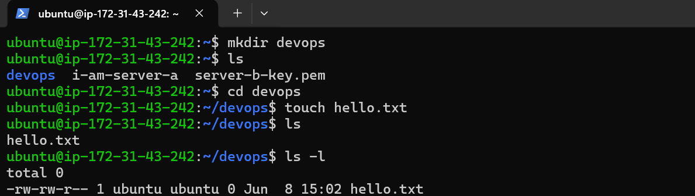
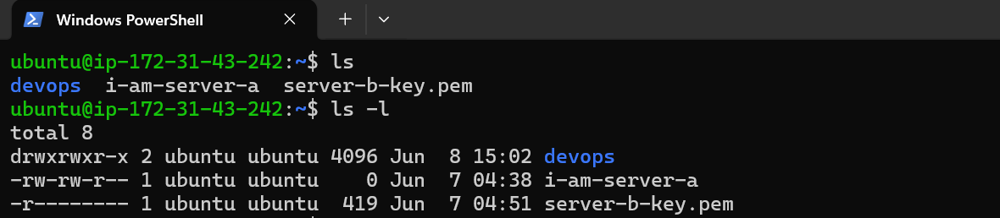
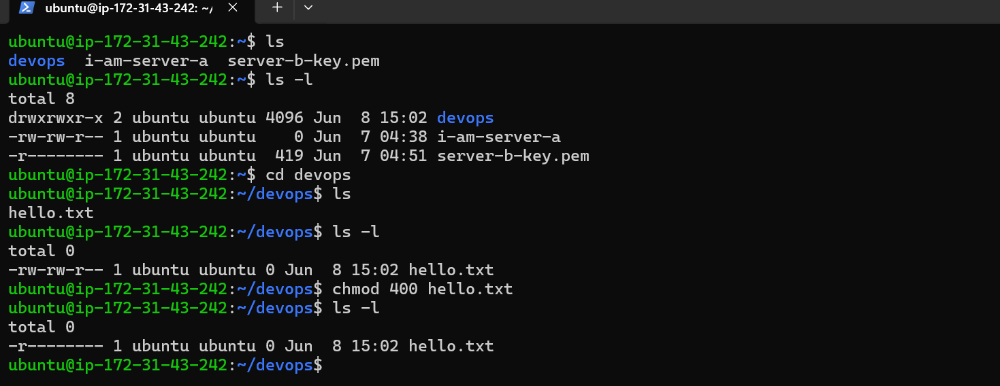
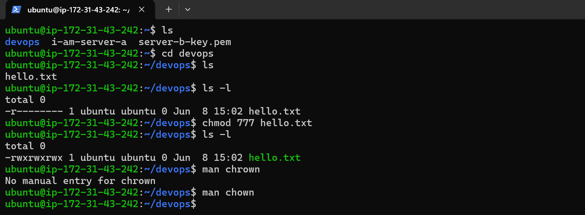
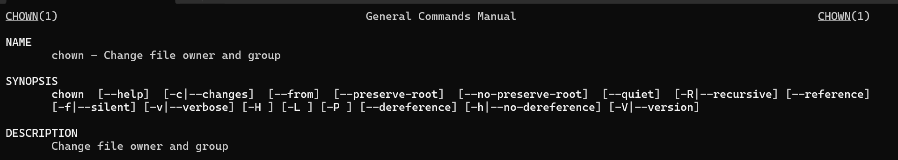
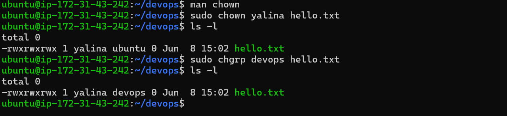

# Linux File Permissions, Ownership, and Groups

## Screenshot 1



## Screenshot 2



## Screenshot 3



## Screenshot 4



## Screenshot 5



## Screenshot 6



---

# 1. List Files

Command:

```bash
ls
```

Output:

```text
devops
i-am-server-a
server-b-key.pem
```

### Purpose

Displays files and directories in the current location.

---

# 2. Long Listing Format

Command:

```bash
ls -l
```

Output:

```text
drwxrwxr-x 2 ubuntu ubuntu 4096 Jun 8 15:02 devops
-rw-rw-r-- 1 ubuntu ubuntu    0 Jun 7 04:38 i-am-server-a
-rw------- 1 ubuntu ubuntu  419 Jun 7 04:51 server-b-key.pem
```

### Meaning

```text
drwxrwxr-x
││ │ │
││ │ └── Others permissions
││ └──── Group permissions
│└────── Owner permissions
└──────── File type
```

---

# 3. Enter Directory

Command:

```bash
cd devops
```

Verify:

```bash
pwd
```

Output:

```text
/home/ubuntu/devops
```

---

# 4. View File Permissions

Command:

```bash
ls -l
```

Output:

```text
-rw-rw-r-- 1 ubuntu ubuntu 0 Jun 8 15:02 hello.txt
```

### Meaning

| Symbol | Permission    |
| ------ | ------------- |
| r      | Read          |
| w      | Write         |
| x      | Execute       |
| -      | No Permission |

---

# 5. Change Permission to 400

Command:

```bash
chmod 400 hello.txt
```

Verify:

```bash
ls -l
```

Output:

```text
-r-------- 1 ubuntu ubuntu 0 Jun 8 15:02 hello.txt
```

### Meaning

Numeric permissions:

```text
4 = Read
2 = Write
1 = Execute
```

```text
400
│ │ │
│ │ └── Others = 0
│ └──── Group = 0
└────── Owner = Read only (4)
```

Result:

* Owner: Read only
* Group: No access
* Others: No access

---

# 6. Change Permission to 777

Command:

```bash
chmod 777 hello.txt
```

Verify:

```bash
ls -l
```

Output:

```text
-rwxrwxrwx 1 ubuntu ubuntu 0 Jun 8 15:02 hello.txt
```

### Meaning

```text
777
│ │ │
│ │ └── Others = rwx
│ └──── Group = rwx
└────── Owner = rwx
```

Everyone gets:

* Read
* Write
* Execute

⚠️ Not recommended for sensitive files.

---

# 7. Read Manual Page

Command:

```bash
man chown
```

### Purpose

Displays the manual page for the `chown` command.

Output begins with:

```text
NAME
    chown - change file owner and group
```

---

# 8. Change File Owner

Command:

```bash
sudo chown yalina hello.txt
```

Verify:

```bash
ls -l
```

Output:

```text
-rwxrwxrwx 1 yalina ubuntu 0 Jun 8 15:02 hello.txt
```

### Meaning

Ownership changed from:

```text
ubuntu
```

to

```text
yalina
```

---

# 9. Change Group Ownership

Command:

```bash
sudo chgrp devops hello.txt
```

Verify:

```bash
ls -l
```

Output:

```text
-rwxrwxrwx 1 yalina devops 0 Jun 8 15:02 hello.txt
```

### Meaning

* Owner = yalina
* Group = devops

---

# Difference Between chown and chgrp

## chown

Changes file owner.

Example:

```bash
sudo chown yalina hello.txt
```

## chgrp

Changes file group.

Example:

```bash
sudo chgrp devops hello.txt
```

---

# Commands Summary

```bash
ls

ls -l

cd devops

chmod 400 hello.txt

chmod 777 hello.txt

man chown

sudo chown yalina hello.txt

sudo chgrp devops hello.txt
```

---

# Key Learning

* `ls` lists files and directories.
* `ls -l` shows detailed permissions.
* `chmod` changes permissions.
* `chmod 400` gives read-only access to owner.
* `chmod 777` gives full access to everyone.
* `man` displays command documentation.
* `chown` changes file ownership.
* `chgrp` changes group ownership.
* Use `ls -l` to verify permission and ownership changes.

///////////////////////////////////////////////////////////////////////////////////////////////////////////////////
