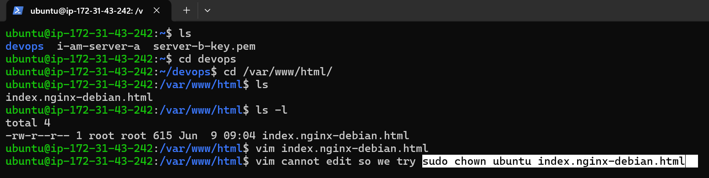
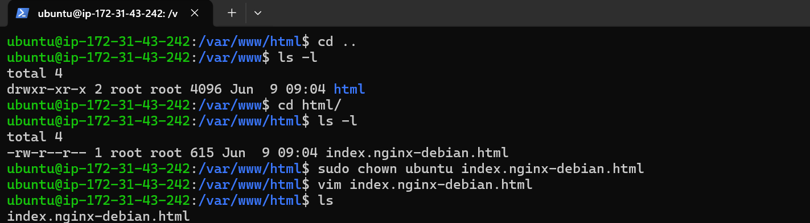
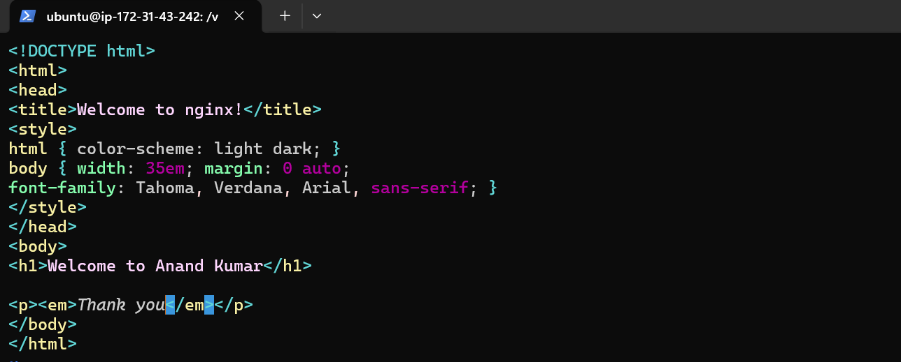
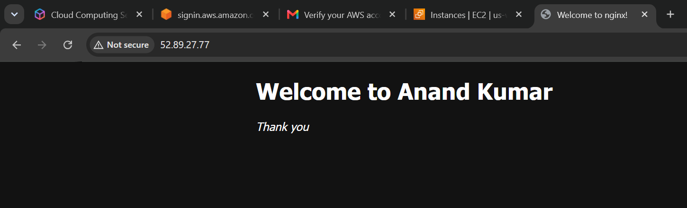
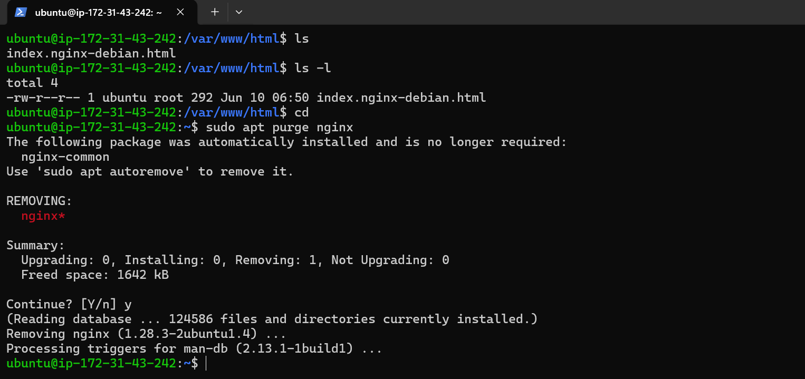
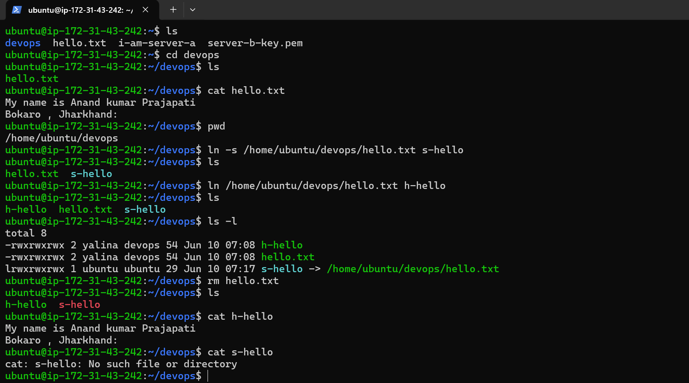

# Linux Package Management and Nginx Service

## Screenshot 1


## Screenshot 2


## Screenshot 3


## Screenshot 4


## Screenshot 5


## Screenshot 6


## Screenshot 7


---

# 1. Update Package Repository

Command:

```bash
sudo apt-get update
```

### Purpose

Downloads the latest package information from Ubuntu repositories.

Example Output:

```text
Hit:1 ubuntu repository
Get:2 ubuntu-updates
Fetched 137 kB
Reading package lists... Done
```

### Important

* Updates package information only.
* Does not install or upgrade software.

---

# 2. Upgrade Installed Packages

Command:

```bash
sudo apt-get upgrade
```

### Purpose

Upgrades installed packages to newer versions.

Example:

```text
4 upgraded, 0 newly installed
Need to get 41.9 MB
Do you want to continue? [Y/n]
```

### Difference

```bash
sudo apt-get update
```

Updates package list.

```bash
sudo apt-get upgrade
```

Installs available updates.

---

# 3. Install Docker

Command:

```bash
sudo apt-get install docker.io
```

### Purpose

Installs Docker Engine from Ubuntu repositories.

Docker is used to create and manage containers.

---

# 4. Install Nginx

Command:

```bash
sudo apt-get install nginx
```

### Purpose

Installs the Nginx web server.

Output:

```text
nginx is already the newest version
```

Meaning Nginx was already installed.

---

# 5. Check Nginx Service Status

Command:

```bash
systemctl status nginx
```

Output:

```text
Active: active (running)
```

### Meaning

Nginx is currently running and serving web requests.

Important fields:

| Field    | Meaning                      |
| -------- | ---------------------------- |
| Loaded   | Service configuration loaded |
| Active   | Current service state        |
| Main PID | Process ID                   |
| Memory   | RAM usage                    |
| Tasks    | Running threads/processes    |

---

# 6. Stop Nginx Service

Command:

```bash
sudo systemctl stop nginx
```

### Purpose

Stops the Nginx service.

Verify:

```bash
systemctl status nginx
```

Output:

```text
Active: inactive (dead)
```

Meaning:

Nginx is no longer running.

---

# 7. Check Service Using Service Command

Command:

```bash
service nginx status
```

### Purpose

Alternative method to view service status.

Output:

```text
Active: inactive (dead)
```

Shows the same information as systemctl.

---

# 8. Stop Nginx Using Service Command

Command:

```bash
sudo service nginx stop
```

### Purpose

Stops Nginx using the legacy service command.

---

# 9. Start Nginx Using Service Command

Command:

```bash
sudo service nginx start
```

### Purpose

Starts the Nginx service.

Verify:

```bash
systemctl status nginx
```

Output:

```text
Active: active (running)
```

---

# 10. Service Lifecycle

```text
Install Nginx
      │
      ▼
sudo apt-get install nginx
      │
      ▼
Check Status
      │
      ▼
systemctl status nginx
      │
      ▼
Stop Service
      │
      ▼
sudo systemctl stop nginx
      │
      ▼
Status = inactive (dead)
      │
      ▼
Start Service
      │
      ▼
sudo service nginx start
      │
      ▼
Status = active (running)
```

---

# Difference Between systemctl and service

## systemctl

Modern service manager.

Examples:

```bash
systemctl status nginx
systemctl start nginx
systemctl stop nginx
systemctl restart nginx
```

---

## service

Older but simpler interface.

Examples:

```bash
service nginx status
service nginx start
service nginx stop
```

---

# Useful Commands Summary

```bash
sudo apt-get update

sudo apt-get upgrade

sudo apt-get install docker.io

sudo apt-get install nginx

systemctl status nginx

sudo systemctl stop nginx

service nginx status

sudo service nginx stop

sudo service nginx start
```

---

# Key Learning

* `apt-get update` refreshes package information.
* `apt-get upgrade` upgrades installed packages.
* `apt-get install` installs software packages.
* Docker is installed using `docker.io`.
* Nginx is a web server and reverse proxy.
* `systemctl status` checks service health.
* `systemctl stop` stops a service.
* `service start` starts a service.
* `active (running)` means the service is working.
* `inactive (dead)` means the service is stopped.

//////////////////////////////////////////////////////////////////////////////////////////////////////////////////////

# AWS Security Group Configuration and Accessing Nginx

## Screenshot 14


## Screenshot 15


## Screenshot 16


## Screenshot 17


## Screenshot 18


## Screenshot 19


## Screenshot 20


## Screenshot 21


---

# Objective

Allow HTTP traffic to the EC2 instance and access the Nginx web server from a web browser.

---

# Step 1: Open EC2 Instance

Login to AWS Management Console.

Navigate to:

```text
AWS Console
   └── EC2
         └── Instances
               └── babu-anand-server
```

Select the EC2 instance:

```text
babu-anand-server
```

---

# Step 2: Open Security Group

From the Instance Summary page:

```text
Instance Details
      │
      ▼
Security Group
```

Click the attached Security Group link.

Example:

```text
sg-0f46xxxxxxxxxxxx
```

---

# Step 3: Edit Inbound Rules

Inside the Security Group:

```text
Security Group
     │
     ▼
Inbound Rules
     │
     ▼
Edit Inbound Rules
```

Click:

```text
Edit Inbound Rules
```

---

# Step 4: Add HTTP Rule

Click:

```text
Add Rule
```

Configure:

| Setting    | Value         |
| ---------- | ------------- |
| Type       | HTTP          |
| Protocol   | TCP           |
| Port Range | 80            |
| Source     | Anywhere IPv4 |
| CIDR       | 0.0.0.0/0     |

Configuration:

```text
Type: HTTP
Port: 80
Source: Anywhere IPv4
```

---

# Step 5: Save Rules

Click:

```text
Save Rules
```

Message:

```text
Successfully modified security group
```

### Why?

HTTP traffic from the internet can now reach the EC2 instance.

Before:

```text
Internet
   │
   ▼
Port 80 Blocked
```

After:

```text
Internet
   │
   ▼
Port 80 Allowed
```

---

# Step 6: Copy Public IP Address

Return to:

```text
EC2
   └── Instances
         └── babu-anand-server
```

Copy:

```text
Public IPv4 Address
```

Example:

```text
54.xx.xx.xx
```

---

# Step 7: Open Browser

Open Chrome and enter:

```text
http://PUBLIC-IP
```

Example:

```text
http://54.xx.xx.xx
```

Important:

Use:

```text
http://
```

not

```text
https://
```

because Nginx is listening on port 80.

---

# Step 8: Verify Nginx Web Server

If Nginx is running correctly, the browser displays:

```text
Welcome to nginx!
```

This confirms:

* EC2 instance is running.
* Security Group allows HTTP traffic.
* Nginx service is running.
* Browser can access the web server.

---

# Architecture Flow

```text
User Browser
      │
      ▼
Public IP Address
      │
      ▼
Security Group
(Port 80 Open)
      │
      ▼
EC2 Instance
      │
      ▼
Nginx Service
      │
      ▼
Welcome to nginx!
```

---

# Verify Nginx from Server

Check status:

```bash
systemctl status nginx
```

Output:

```text
Active: active (running)
```

If stopped:

```bash
sudo systemctl start nginx
```

Verify again:

```bash
systemctl status nginx
```

---

# Troubleshooting

### Website Not Opening

Check:

```bash
systemctl status nginx
```

Nginx must be:

```text
active (running)
```

---

### Port 80 Closed

Verify Security Group:

```text
Inbound Rule
Port 80
Source 0.0.0.0/0
```

---

### Wrong URL

Correct:

```text
http://PUBLIC-IP
```

Wrong:

```text
https://PUBLIC-IP
```

---

# Commands Summary

```bash
sudo systemctl status nginx

sudo systemctl start nginx

sudo systemctl stop nginx

sudo systemctl restart nginx
```

---

# Key Learning

* Security Groups act as virtual firewalls for EC2.
* Inbound Rules control incoming traffic.
* Port 80 is used for HTTP.
* Nginx is a web server that serves web pages.
* Public IP allows internet access to the EC2 instance.
* Opening Port 80 enables browser access to Nginx.
* "Welcome to nginx!" confirms successful deployment.

////////////////////////////////////////////////////////////////////////////////////////////////////////////////

# Customizing the Nginx Default Web Page

## Screenshot 22



## Screenshot 23



## Screenshot 24



## Screenshot 25



---

# Objective

Modify the default Nginx web page and display a custom message in the browser.

---

# 1. Go to Nginx Web Root Directory

Command:

```bash
cd /var/www/html/
```

Check files:

```bash
ls
```

Output:

```text
index.nginx-debian.html
```

### Purpose

`/var/www/html` is the default web root directory used by Nginx.

---

# 2. Check File Permissions

Command:

```bash
ls -l
```

Output:

```text
-rw-r--r-- 1 root root 615 Jun 9 09:04 index.nginx-debian.html
```

### Meaning

* Owner = root
* Group = root
* Normal users cannot modify the file.

---

# 3. Why Vim Could Not Edit the File

Command:

```bash
vim index.nginx-debian.html
```

Problem:

```text
Permission denied
```

### Reason

The file is owned by the root user.

```text
Owner: root
Group: root
```

The `ubuntu` user does not have write permission.

---

# 4. Change File Ownership

Command:

```bash
sudo chown ubuntu index.nginx-debian.html
```

Verify:

```bash
ls -l
```

Example:

```text
-rw-r--r-- 1 ubuntu root 615 Jun 9 09:04 index.nginx-debian.html
```

### Purpose

Transfers ownership from `root` to `ubuntu`.

Now the file can be edited without sudo.

---

# 5. Edit the Default Nginx Page

Command:

```bash
vim index.nginx-debian.html
```

Replace the default content with:

```html
<!DOCTYPE html>
<html>
<head>
    <title>Welcome to nginx!</title>
</head>
<body>
    <h1>Welcome to Anand Kumar</h1>
    <p><em>Thank you</em></p>
</body>
</html>
```

Save and exit Vim:

```text
ESC
:wq
```

---

# 6. Open the Website

Copy the EC2 Public IPv4 address and open:

```text
http://52.89.27.77
```

(Use your instance IP address.)

---

# 7. Verify the Output

Browser displays:

```text
Welcome to Anand Kumar

Thank you
```

This confirms:

✅ Nginx is running

✅ Port 80 is open in the Security Group

✅ HTML page was modified successfully

✅ Browser can access the EC2 web server

---

# Architecture Flow

```text
Browser
   │
   ▼
Public IP Address
   │
   ▼
Security Group (Port 80 Open)
   │
   ▼
EC2 Instance
   │
   ▼
Nginx Web Server
   │
   ▼
/var/www/html/index.nginx-debian.html
   │
   ▼
Custom Web Page Displayed
```

---

# Commands Summary

```bash
cd /var/www/html/

ls

ls -l

sudo chown ubuntu index.nginx-debian.html

vim index.nginx-debian.html
```

---

# Key Learning

* `/var/www/html` is the default Nginx web root directory.
* `index.nginx-debian.html` is the default web page.
* Root-owned files cannot be edited by normal users.
* `chown` changes file ownership.
* Vim is used to edit HTML files.
* Nginx automatically serves files from `/var/www/html`.
* Changes become visible when accessing the EC2 Public IP in a browser.

////////////////////////////////////////////////////////////////////////////////////////////////////////////////////

# Removing Nginx from Ubuntu Server

## Screenshot 26



---

# Objective

Remove the Nginx web server package from the Ubuntu system using the `apt purge` command.

---

# 1. Remove Nginx Package

Command:

```bash
sudo apt purge nginx
```

### Purpose

The `purge` command removes:

* Nginx package
* Configuration files
* Package settings

Unlike `remove`, `purge` also deletes configuration files.

---

# Output Analysis

```text
The following package was automatically installed and is no longer required:
nginx-common

Use 'sudo apt autoremove' to remove it.
```

### Meaning

When Nginx was installed, Ubuntu automatically installed:

```text
nginx-common
```

Since Nginx is being removed, this package is no longer needed.

---

# Packages Being Removed

Output:

```text
Removing:
 nginx*
```

### Meaning

The main Nginx package will be deleted from the system.

---

# Space Freed

Output:

```text
Freed space: 1642 kB
```

### Meaning

Disk space occupied by the Nginx package is released.

---

# Confirmation Prompt

Output:

```text
Continue? [Y/n]
```

Response:

```text
y
```

Meaning:

Proceed with the package removal.

---

# Package Removal Process

Output:

```text
Removing nginx (1.28.3-2ubuntu1.4)
```

### Meaning

Ubuntu is uninstalling the Nginx package from the system.

---

# Trigger Processing

Output:

```text
Processing triggers for man-db
```

### Meaning

Ubuntu updates related system documentation and package metadata after removal.

---

# Verify Nginx Removal

Check:

```bash
which nginx
```

or

```bash
systemctl status nginx
```

Expected result:

```text
Unit nginx.service could not be found.
```

or

```text
nginx: command not found
```

---

# Remove Unused Dependencies

Ubuntu suggested:

```bash
sudo apt autoremove
```

Purpose:

Remove unused packages such as:

```text
nginx-common
```

Command:

```bash
sudo apt autoremove -y
```

---

# Difference Between Remove and Purge

| Command               | Removes Package | Removes Configuration Files |
| --------------------- | --------------- | --------------------------- |
| sudo apt remove nginx | ✅ Yes           | ❌ No                        |
| sudo apt purge nginx  | ✅ Yes           | ✅ Yes                       |

---

# Package Lifecycle

```text
Install Package
      │
      ▼
sudo apt install nginx
      │
      ▼
Start Service
      │
      ▼
systemctl status nginx
      │
      ▼
Use Nginx
      │
      ▼
sudo apt purge nginx
      │
      ▼
Nginx Removed
      │
      ▼
sudo apt autoremove
      │
      ▼
Unused Dependencies Removed
```

---

# Commands Summary

```bash
sudo apt purge nginx

sudo apt autoremove

which nginx

systemctl status nginx
```

---

# Key Learning

* `apt purge` removes both the package and its configuration files.
* Ubuntu may leave dependency packages behind after removal.
* `apt autoremove` cleans unused dependencies.
* Purging Nginx removes the web server from the system.
* Always verify removal using `which nginx` or `systemctl status nginx`.

////////////////////////////////////////////////////////////////////////////////////////////////////////////////

# Linux Hard Link vs Soft Link (Symbolic Link)

## Screenshot 27



---

# Objective

Understand the difference between **Hard Links** and **Soft Links (Symbolic Links)** in Linux.

---

# 1. Original File

Command:

```bash
cat hello.txt
```

Output:

```text
My name is Anand Kumar Prajapati
Bokaro, Jharkhand
```

Check current directory:

```bash
pwd
```

Output:

```text
/home/ubuntu/devops
```

---

# 2. Create a Soft Link

Command:

```bash
ln -s /home/ubuntu/devops/hello.txt s-hello
```

### Meaning

* `ln` = create link
* `-s` = symbolic (soft) link
* `s-hello` = shortcut pointing to hello.txt

Verify:

```bash
ls -l
```

Output:

```text
lrwxrwxrwx 1 ubuntu ubuntu 29 Jun 10 07:17 s-hello -> /home/ubuntu/devops/hello.txt
```

Notice:

```text
l
```

at the beginning indicates a symbolic link.

---

# 3. Create a Hard Link

Command:

```bash
ln /home/ubuntu/devops/hello.txt h-hello
```

Verify:

```bash
ls -l
```

Output:

```text
-rwxrwxrwx 2 yalina devops 54 Jun 10 07:08 h-hello
-rwxrwxrwx 2 yalina devops 54 Jun 10 07:08 hello.txt
```

Notice:

```text
2
```

The link count becomes 2 because both names point to the same inode.

---

# 4. Directory Contents

Command:

```bash
ls
```

Output:

```text
h-hello
hello.txt
s-hello
```

---

# 5. Delete Original File

Command:

```bash
rm hello.txt
```

Check:

```bash
ls
```

Output:

```text
h-hello
s-hello
```

The original file name is removed.

---

# 6. Test Hard Link

Command:

```bash
cat h-hello
```

Output:

```text
My name is Anand Kumar Prajapati
Bokaro, Jharkhand
```

### Why It Works

Hard links share the same inode and actual data.

Even after deleting `hello.txt`, the data still exists because `h-hello` points directly to it.

---

# 7. Test Soft Link

Command:

```bash
cat s-hello
```

Output:

```text
cat: s-hello: No such file or directory
```

### Why It Failed

A soft link stores only the path of the original file.

```text
s-hello
    │
    ▼
hello.txt
```

After deleting `hello.txt`, the path becomes invalid.

The soft link becomes a **broken link**.

---

# Visual Representation

## Hard Link

```text
hello.txt
     │
     ▼
   [inode]
     ▲
     │
h-hello
```

After deleting `hello.txt`:

```text
h-hello
    │
    ▼
 [inode]
```

✅ Data still exists.

---

## Soft Link

```text
s-hello
    │
    ▼
hello.txt
    │
    ▼
  Data
```

After deleting `hello.txt`:

```text
s-hello
    │
    ▼
hello.txt ❌ Missing
```

❌ Link breaks.

---

# Hard Link vs Soft Link

| Feature                         | Hard Link          | Soft Link        |
| ------------------------------- | ------------------ | ---------------- |
| Uses inode directly             | ✅ Yes              | ❌ No             |
| Survives original file deletion | ✅ Yes              | ❌ No             |
| Can link directories            | ❌ No               | ✅ Yes            |
| Can cross file systems          | ❌ No               | ✅ Yes            |
| File type shown as              | `-`                | `l`              |
| Stores file data                | Directly via inode | Stores file path |

---

# Useful Commands

Create Soft Link:

```bash
ln -s hello.txt s-hello
```

Create Hard Link:

```bash
ln hello.txt h-hello
```

Show Links:

```bash
ls -l
```

Show Inode Numbers:

```bash
ls -li
```

Delete File:

```bash
rm hello.txt
```

---

# Key Learning

* Hard links point directly to the file inode.
* Soft links point to the file path.
* Hard links continue working even after the original filename is deleted.
* Soft links break if the original file is removed.
* `ls -l` shows `l` for symbolic links.
* Hard links increase the file link count.


