# Linux Package Management and Nginx Service

## Screenshot 1

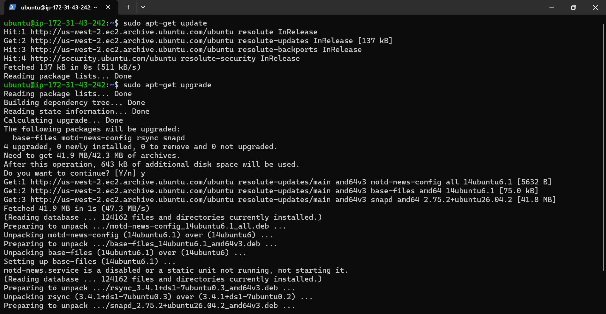

## Screenshot 2

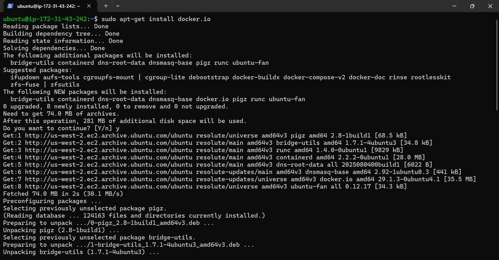

## Screenshot 3

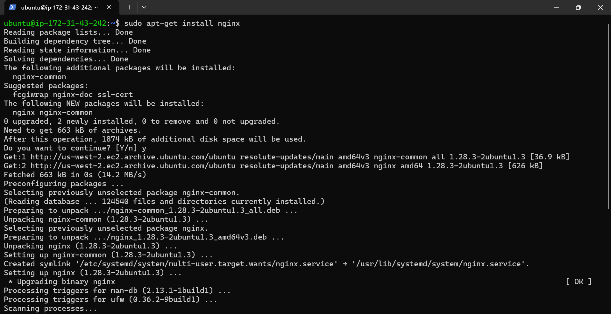

## Screenshot 4

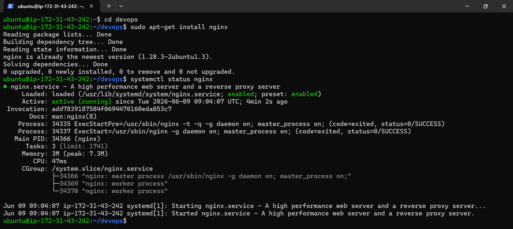

## Screenshot 5

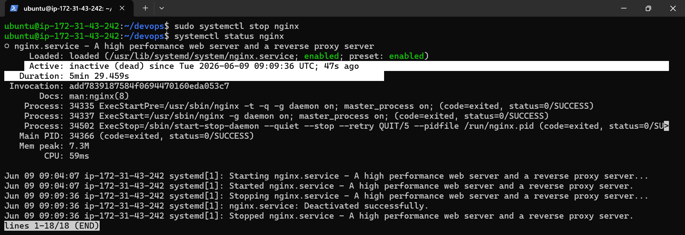

## Screenshot 6

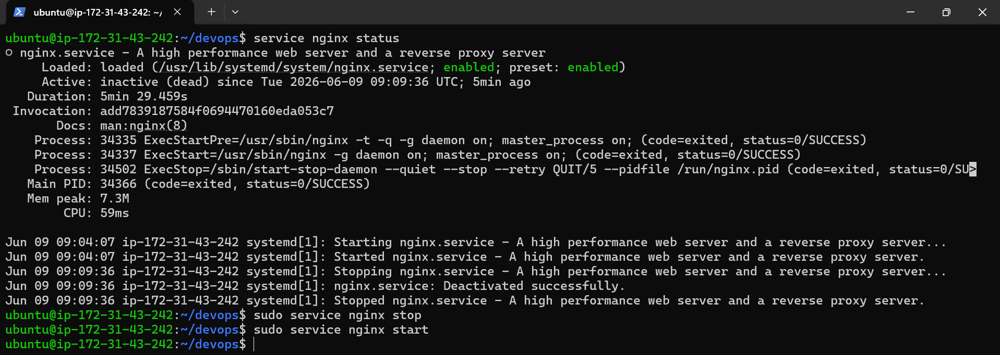

## Screenshot 7

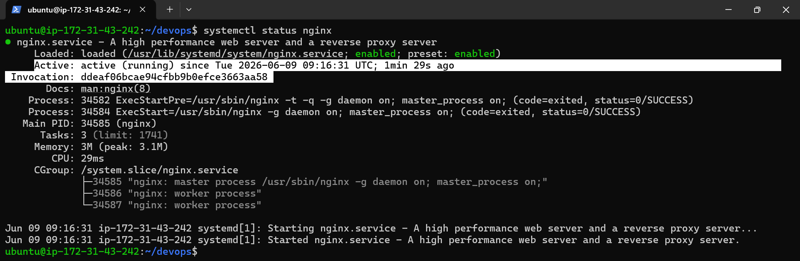
---

# 1. Update Package Repository

Command:

```bash
sudo apt-get update
```

### Purpose

Downloads the latest package information from Ubuntu repositories.

Example Output:

```text
Hit:1 ubuntu repository
Get:2 ubuntu-updates
Fetched 137 kB
Reading package lists... Done
```

### Important

* Updates package information only.
* Does not install or upgrade software.

---

# 2. Upgrade Installed Packages

Command:

```bash
sudo apt-get upgrade
```

### Purpose

Upgrades installed packages to newer versions.

Example:

```text
4 upgraded, 0 newly installed
Need to get 41.9 MB
Do you want to continue? [Y/n]
```

### Difference

```bash
sudo apt-get update
```

Updates package list.

```bash
sudo apt-get upgrade
```

Installs available updates.

---

# 3. Install Docker

Command:

```bash
sudo apt-get install docker.io
```

### Purpose

Installs Docker Engine from Ubuntu repositories.

Docker is used to create and manage containers.

---

# 4. Install Nginx

Command:

```bash
sudo apt-get install nginx
```

### Purpose

Installs the Nginx web server.

Output:

```text
nginx is already the newest version
```

Meaning Nginx was already installed.

---

# 5. Check Nginx Service Status

Command:

```bash
systemctl status nginx
```

Output:

```text
Active: active (running)
```

### Meaning

Nginx is currently running and serving web requests.

Important fields:

| Field    | Meaning                      |
| -------- | ---------------------------- |
| Loaded   | Service configuration loaded |
| Active   | Current service state        |
| Main PID | Process ID                   |
| Memory   | RAM usage                    |
| Tasks    | Running threads/processes    |

---

# 6. Stop Nginx Service

Command:

```bash
sudo systemctl stop nginx
```

### Purpose

Stops the Nginx service.

Verify:

```bash
systemctl status nginx
```

Output:

```text
Active: inactive (dead)
```

Meaning:

Nginx is no longer running.

---

# 7. Check Service Using Service Command

Command:

```bash
service nginx status
```

### Purpose

Alternative method to view service status.

Output:

```text
Active: inactive (dead)
```

Shows the same information as systemctl.

---

# 8. Stop Nginx Using Service Command

Command:

```bash
sudo service nginx stop
```

### Purpose

Stops Nginx using the legacy service command.

---

# 9. Start Nginx Using Service Command

Command:

```bash
sudo service nginx start
```

### Purpose

Starts the Nginx service.

Verify:

```bash
systemctl status nginx
```

Output:

```text
Active: active (running)
```

---

# 10. Service Lifecycle

```text
Install Nginx
      │
      ▼
sudo apt-get install nginx
      │
      ▼
Check Status
      │
      ▼
systemctl status nginx
      │
      ▼
Stop Service
      │
      ▼
sudo systemctl stop nginx
      │
      ▼
Status = inactive (dead)
      │
      ▼
Start Service
      │
      ▼
sudo service nginx start
      │
      ▼
Status = active (running)
```

---

# Difference Between systemctl and service

## systemctl

Modern service manager.

Examples:

```bash
systemctl status nginx
systemctl start nginx
systemctl stop nginx
systemctl restart nginx
```

---

## service

Older but simpler interface.

Examples:

```bash
service nginx status
service nginx start
service nginx stop
```

---

# Useful Commands Summary

```bash
sudo apt-get update

sudo apt-get upgrade

sudo apt-get install docker.io

sudo apt-get install nginx

systemctl status nginx

sudo systemctl stop nginx

service nginx status

sudo service nginx stop

sudo service nginx start
```

---

# Key Learning

* `apt-get update` refreshes package information.
* `apt-get upgrade` upgrades installed packages.
* `apt-get install` installs software packages.
* Docker is installed using `docker.io`.
* Nginx is a web server and reverse proxy.
* `systemctl status` checks service health.
* `systemctl stop` stops a service.
* `service start` starts a service.
* `active (running)` means the service is working.
* `inactive (dead)` means the service is stopped.

//////////////////////////////////////////////////////////////////////////////////////////////////////////////////////

# AWS Security Group Configuration and Accessing Nginx

## Screenshot 14

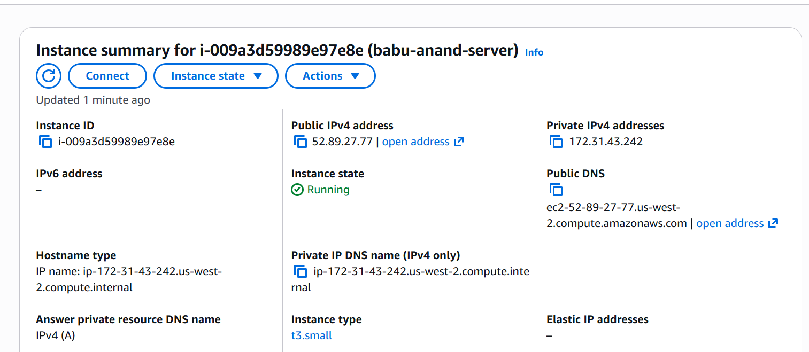

## Screenshot 15

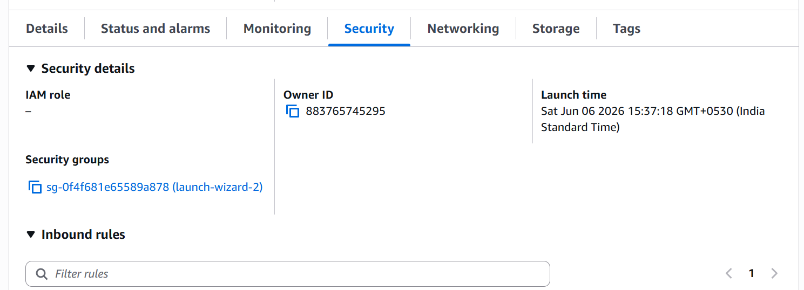

## Screenshot 16

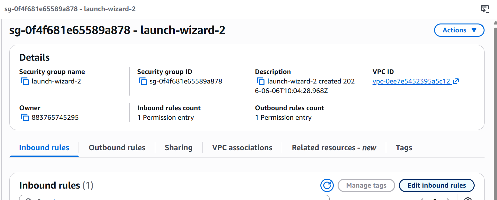

## Screenshot 17

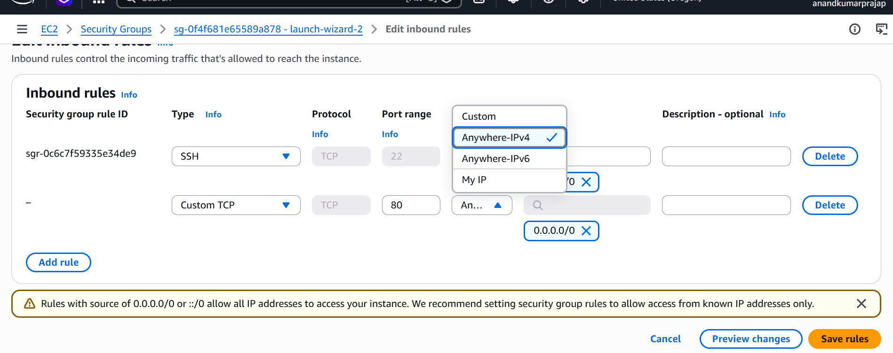

## Screenshot 18

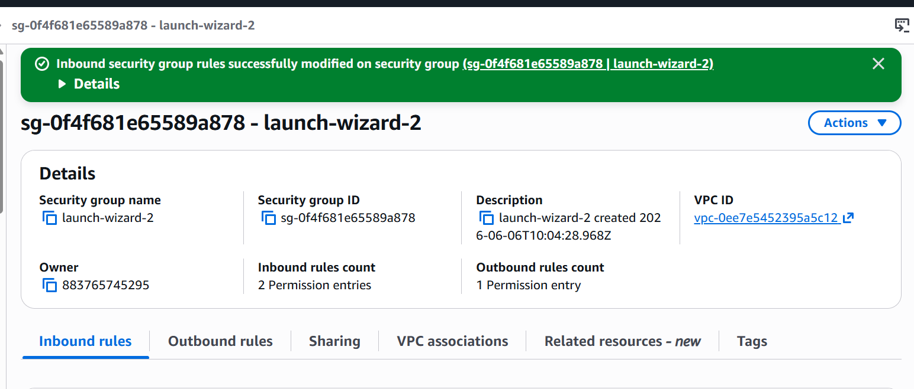

## Screenshot 19

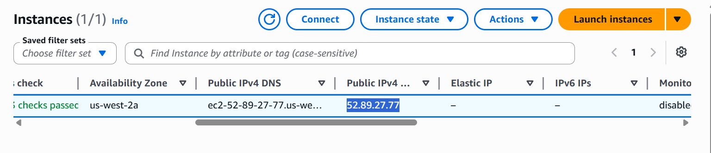

## Screenshot 20

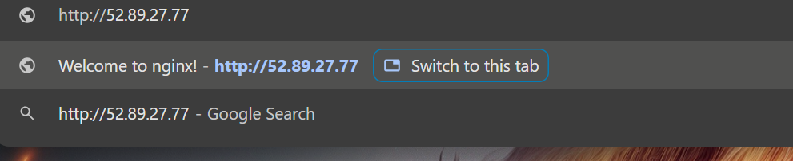

## Screenshot 21

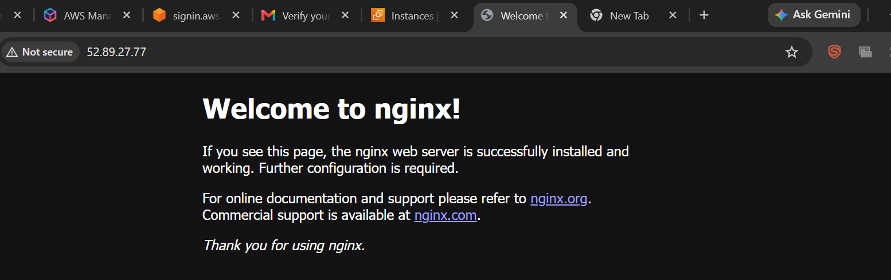

---

# Objective

Allow HTTP traffic to the EC2 instance and access the Nginx web server from a web browser.

---

# Step 1: Open EC2 Instance

Login to AWS Management Console.

Navigate to:

```text
AWS Console
   └── EC2
         └── Instances
               └── babu-anand-server
```

Select the EC2 instance:

```text
babu-anand-server
```

---

# Step 2: Open Security Group

From the Instance Summary page:

```text
Instance Details
      │
      ▼
Security Group
```

Click the attached Security Group link.

Example:

```text
sg-0f46xxxxxxxxxxxx
```

---

# Step 3: Edit Inbound Rules

Inside the Security Group:

```text
Security Group
     │
     ▼
Inbound Rules
     │
     ▼
Edit Inbound Rules
```

Click:

```text
Edit Inbound Rules
```

---

# Step 4: Add HTTP Rule

Click:

```text
Add Rule
```

Configure:

| Setting    | Value         |
| ---------- | ------------- |
| Type       | HTTP          |
| Protocol   | TCP           |
| Port Range | 80            |
| Source     | Anywhere IPv4 |
| CIDR       | 0.0.0.0/0     |

Configuration:

```text
Type: HTTP
Port: 80
Source: Anywhere IPv4
```

---

# Step 5: Save Rules

Click:

```text
Save Rules
```

Message:

```text
Successfully modified security group
```

### Why?

HTTP traffic from the internet can now reach the EC2 instance.

Before:

```text
Internet
   │
   ▼
Port 80 Blocked
```

After:

```text
Internet
   │
   ▼
Port 80 Allowed
```

---

# Step 6: Copy Public IP Address

Return to:

```text
EC2
   └── Instances
         └── babu-anand-server
```

Copy:

```text
Public IPv4 Address
```

Example:

```text
54.xx.xx.xx
```

---

# Step 7: Open Browser

Open Chrome and enter:

```text
http://PUBLIC-IP
```

Example:

```text
http://54.xx.xx.xx
```

Important:

Use:

```text
http://
```

not

```text
https://
```

because Nginx is listening on port 80.

---

# Step 8: Verify Nginx Web Server

If Nginx is running correctly, the browser displays:

```text
Welcome to nginx!
```

This confirms:

* EC2 instance is running.
* Security Group allows HTTP traffic.
* Nginx service is running.
* Browser can access the web server.

---

# Architecture Flow

```text
User Browser
      │
      ▼
Public IP Address
      │
      ▼
Security Group
(Port 80 Open)
      │
      ▼
EC2 Instance
      │
      ▼
Nginx Service
      │
      ▼
Welcome to nginx!
```

---

# Verify Nginx from Server

Check status:

```bash
systemctl status nginx
```

Output:

```text
Active: active (running)
```

If stopped:

```bash
sudo systemctl start nginx
```

Verify again:

```bash
systemctl status nginx
```

---

# Troubleshooting

### Website Not Opening

Check:

```bash
systemctl status nginx
```

Nginx must be:

```text
active (running)
```

---

### Port 80 Closed

Verify Security Group:

```text
Inbound Rule
Port 80
Source 0.0.0.0/0
```

---

### Wrong URL

Correct:

```text
http://PUBLIC-IP
```

Wrong:

```text
https://PUBLIC-IP
```

---

# Commands Summary

```bash
sudo systemctl status nginx

sudo systemctl start nginx

sudo systemctl stop nginx

sudo systemctl restart nginx
```

---

# Key Learning

* Security Groups act as virtual firewalls for EC2.
* Inbound Rules control incoming traffic.
* Port 80 is used for HTTP.
* Nginx is a web server that serves web pages.
* Public IP allows internet access to the EC2 instance.
* Opening Port 80 enables browser access to Nginx.
* "Welcome to nginx!" confirms successful deployment.

