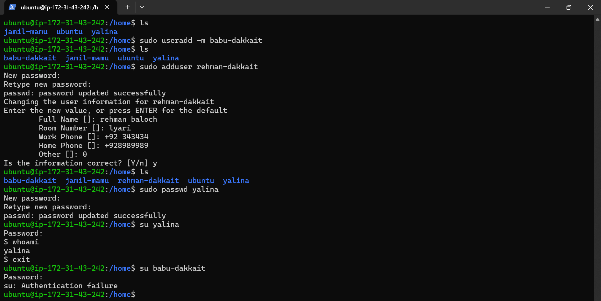
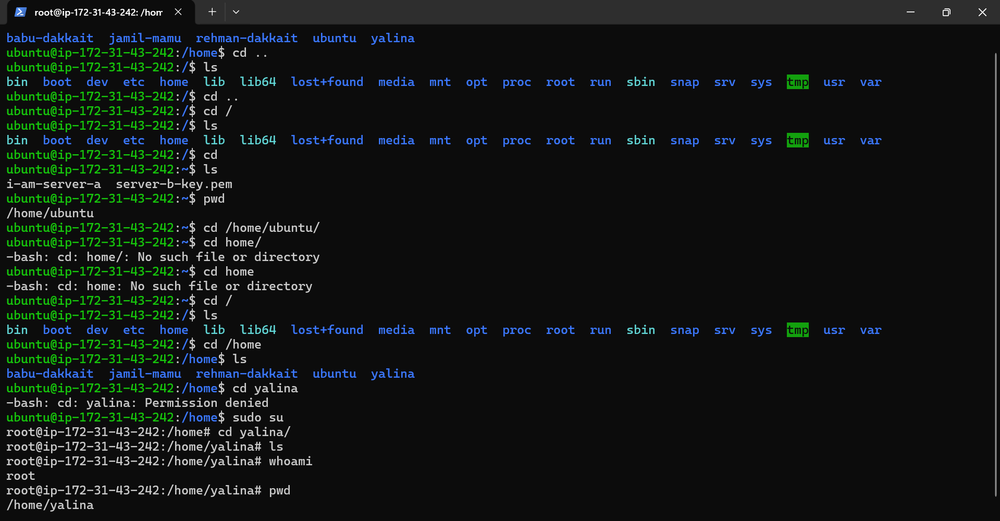
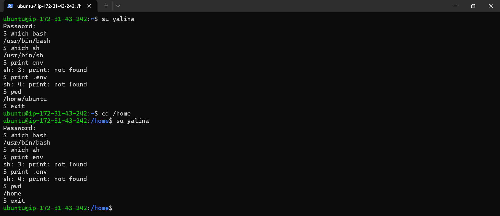

# Linux User Management Notes

## Screenshot


---

## 1. Why `useradd hamza` Failed

Command:

```bash
useradd hamza
```

Output:

```bash
useradd: Permission denied.
useradd: cannot lock /etc/passwd; try again later.
```

### Reason

The `ubuntu` user is a normal user and cannot modify system files such as:

```text
/etc/passwd
/etc/shadow
/etc/group
```

Creating users requires root privileges.

### Correct Command

```bash
sudo useradd hamza
```

---

## 2. Create User Using `useradd`

Command:

```bash
sudo useradd hamza
```

### What Happens

* Creates a new user account named `hamza`
* Adds an entry to `/etc/passwd`
* Does NOT create a home directory by default
* Does NOT ask for a password

Check:

```bash
cat /etc/passwd | grep hamza
```

---

## 3. Create User with Home Directory

Command:

```bash
sudo useradd -m yalina
```

### Options

| Option | Meaning               |
| ------ | --------------------- |
| `-m`   | Create home directory |

### Result

Creates:

```text
/home/yalina
```

Verify:

```bash
ls /home
```

Output:

```text
ubuntu  yalina
```

---

## 4. Create User Using `adduser`

Command:

```bash
sudo adduser jamil-mamu
```

### What Happens

`adduser` is a user-friendly wrapper around `useradd`.

It automatically:

* Creates user
* Creates home directory
* Creates user group
* Sets password
* Collects user information

Example:

```text
New password:
Retype new password:
Full Name:
Room Number:
Work Phone:
Home Phone:
```

Result:

```text
/home/jamil-mamu
```

Verify:

```bash
ls /home
```

Output:

```text
jamil-mamu  ubuntu  yalina
```

---

## 5. Why `hamza` Is Not Visible in `ls /home`

Command:

```bash
sudo useradd hamza
```

Then:

```bash
ls /home
```

Output:

```text
jamil-mamu ubuntu yalina
```

### Reason

`useradd` does NOT create a home directory unless `-m` is specified.

Therefore:

```text
/home/hamza
```

does not exist.

So `ls /home` cannot show `hamza`.

---

## 6. Command That Creates Home Directory

Command:

```bash
sudo useradd -m hamza
```

Creates:

```text
/home/hamza
```

Now:

```bash
ls /home
```

Output:

```text
hamza  jamil-mamu  ubuntu  yalina
```

---

## Difference Between `useradd` and `adduser`

| Feature                | useradd | adduser |
| ---------------------- | ------- | ------- |
| Creates User           | Yes     | Yes     |
| Creates Home Directory | No      | Yes     |
| Asks Password          | No      | Yes     |
| Interactive            | No      | Yes     |
| Beginner Friendly      | No      | Yes     |

### Recommended

For daily administration:

```bash
sudo adduser username
```

For scripting and automation:

```bash
sudo useradd -m username
```

---

## Commands Used

```bash
sudo useradd hamza

sudo useradd -m yalina

sudo adduser jamil-mamu

ls /home

cat /etc/passwd | grep username
```

//////////////////////////////////////////////////////////////////////////////////////////

# Linux User Management – Part 2

## Screenshot



---

## 1. Create User with Home Directory

Command:

```bash
sudo useradd -m babu-dakkait
```

### Explanation

| Option    | Meaning                      |
| --------- | ---------------------------- |
| `sudo`    | Run command as administrator |
| `useradd` | Create a new user            |
| `-m`      | Create home directory        |

### Result

A new user and home directory are created:

```text
/home/babu-dakkait
```

Verify:

```bash
ls /home
```

Output:

```text
babu-dakkait
jamil-mamu
ubuntu
yalina
```

---

## 2. Create User Using adduser

Command:

```bash
sudo adduser rehman-dakkait
```

### What adduser Does

* Creates user account
* Creates home directory
* Creates group
* Sets password
* Collects user information

Example:

```text
Full Name : rehman baloch
Room Number : lyari
Work Phone : +92 343434
Home Phone : +928989989
```

Verify:

```bash
ls /home
```

Output:

```text
babu-dakkait
jamil-mamu
rehman-dakkait
ubuntu
yalina
```

---

## 3. Change User Password

Command:

```bash
sudo passwd yalina
```

### Purpose

Changes the password of an existing user.

Process:

```text
New password:
Retype new password:
passwd: password updated successfully
```

---

## 4. Switch User Account

Command:

```bash
su yalina
```

### Purpose

Switch from current user to another user account.

System asks for yalina's password:

```text
Password:
```

After successful login:

```bash
whoami
```

Output:

```text
yalina
```

This confirms you are logged in as `yalina`.

---

## 5. Exit from Switched User

Command:

```bash
exit
```

### Purpose

Return to the previous user session.

Example:

```text
yalina → ubuntu
```

---

## 6. Authentication Failure

Command:

```bash
su babu-dakkait
```

Output:

```text
su: Authentication failure
```

### Reason

Possible causes:

1. No password was set for `babu-dakkait`
2. Incorrect password entered
3. User account password is locked

Check user information:

```bash
sudo passwd -S babu-dakkait
```

Set a password:

```bash
sudo passwd babu-dakkait
```

Then try again:

```bash
su babu-dakkait
```

---

## Commands Summary

```bash
sudo useradd -m babu-dakkait

sudo adduser rehman-dakkait

sudo passwd yalina

su yalina

whoami

exit

sudo passwd babu-dakkait

su babu-dakkait
```

---

## Key Learning

### `useradd -m`

Creates:

* User account
* Home directory

### `adduser`

Creates:

* User account
* Home directory
* Group
* Password
* User information

### `passwd`

Used to:

* Set password
* Change password

### `su`

Used to switch from one user account to another.

### `whoami`

Displays the currently logged-in user.

/////////////////////////////////////////////////////////////////////////////////////////

# Linux Navigation and User Directory Permissions

## Screenshot



---

# 1. Moving to Parent Directory

Command:

```bash
cd ..
```

### Purpose

Moves one level up from the current directory.

Example:

```text
Current Directory:
/home

After:
cd ..

New Directory:
/
```

---

# 2. Go to Root Directory

Command:

```bash
cd /
```

### Purpose

Moves directly to the root directory of the Linux filesystem.

Verify:

```bash
pwd
```

Output:

```text
/
```

---

# 3. List Files and Directories

Command:

```bash
ls
```

Output:

```text
bin  boot  dev  etc  home  lib  lib64
lost+found  media  mnt  opt  proc
root  run  sbin  snap  srv  sys
tmp  usr  var
```

### Important Directories

| Directory | Purpose                |
| --------- | ---------------------- |
| /bin      | Essential commands     |
| /boot     | Boot files             |
| /dev      | Device files           |
| /etc      | Configuration files    |
| /home     | User home directories  |
| /root     | Root user's home       |
| /tmp      | Temporary files        |
| /usr      | User programs          |
| /var      | Logs and variable data |

---

# 4. Return to Home Directory

Command:

```bash
cd
```

### Purpose

Moves to the current user's home directory.

Verify:

```bash
pwd
```

Output:

```text
/home/ubuntu
```

---

# 5. Absolute Path Navigation

Command:

```bash
cd /home/ubuntu
```

### Purpose

Moves directly to a directory using its full path.

This is called an **absolute path**.

---

# 6. Why `cd home/` Failed

Command:

```bash
cd home/
```

Output:

```text
-bash: cd: home/: No such file or directory
```

### Reason

Current location:

```text
/home/ubuntu
```

Linux searches for:

```text
/home/ubuntu/home
```

Since that directory does not exist, the command fails.

---

# 7. Correct Way

Use an absolute path:

```bash
cd /home
```

Now:

```bash
pwd
```

Output:

```text
/home
```

---

# 8. View All User Home Directories

Command:

```bash
ls /home
```

Output:

```text
babu-dakkait
jamil-mamu
rehman-dakkait
ubuntu
yalina
```

These are user home directories.

---

# 9. Why `cd yalina` Failed

Command:

```bash
cd yalina
```

Output:

```text
-bash: cd: yalina: Permission denied
```

### Reason

You are logged in as:

```text
ubuntu
```

The directory:

```text
/home/yalina
```

belongs to user `yalina`.

The ubuntu user does not have permission to access it.

---

# 10. Become Root User

Command:

```bash
sudo su
```

### Purpose

Switches to the root account.

Prompt changes:

```text
ubuntu@server$
```

to

```text
root@server#
```

The `#` symbol indicates root privileges.

---

# 11. Access Another User's Home Directory

As root:

```bash
cd /home/yalina
```

Check:

```bash
pwd
```

Output:

```text
/ home / yalina
```

---

# 12. Verify Current User

Command:

```bash
whoami
```

Output:

```text
root
```

### Purpose

Displays the currently logged-in user.

---

# Commands Used

```bash
cd ..

cd /

ls

cd

pwd

cd /home

ls /home

cd yalina

sudo su

cd /home/yalina

whoami
```

---

# Key Learning

* `cd ..` → Move to parent directory.
* `cd /` → Go to root directory.
* `cd` → Go to your home directory.
* `pwd` → Show current directory.
* `ls` → List files and directories.
* `sudo su` → Become root user.
* Root can access all users' directories.
* Normal users may receive **Permission denied** when accessing another user's home directory.

//////////////////////////////////////////////////////////////////////////////////////

# Linux User Home Directories and /etc/passwd

## Screenshot

.png)

---

# 1. View All User Home Directories

Command:

```bash
ls /home
```

Output:

```text
babu-dakkait
jamil-mamu
rehman-dakkait
ubuntu
yalina
```

### Explanation

The `/home` directory stores home directories for regular users.

Example:

```text
/home/babu-dakkait
/home/jamil-mamu
/home/rehman-dakkait
/home/ubuntu
/home/yalina
```

---

# 2. Switch to Root User

Command:

```bash
sudo su
```

### Purpose

Switches from the current user to the root user.

Prompt changes:

```text
ubuntu@server$
```

to

```text
root@server#
```

The `#` symbol indicates root privileges.

---

# 3. Access User Home Directory

Command:

```bash
cd babu-dakkait/
```

Check location:

```bash
pwd
```

Output:

```text
/home/babu-dakkait
```

### Explanation

You entered the home directory of user `babu-dakkait`.

---

# 4. Why `cd root/` Failed

Command:

```bash
cd root/
```

Output:

```text
bash: cd: root/: No such file or directory
```

### Reason

Current location:

```text
/home/babu-dakkait
```

Linux searches for:

```text
/home/babu-dakkait/root
```

This directory does not exist.

---

# 5. Correct Way to Reach Root Home Directory

Use an absolute path:

```bash
cd /root
```

Check:

```bash
pwd
```

Output:

```text
/root
```

### Important

`/root` is the home directory of the root user.

Do not confuse:

```text
root
```

with

```text
/ root
```

The leading slash (`/`) is important.

---

# 6. Access Another User Directory

Command:

```bash
cd /home/jamil-mamu
```

Verify:

```bash
pwd
```

Output:

```text
/home/jamil-mamu
```

---

# 7. Return to Previous User

Command:

```bash
exit
```

### Purpose

Leaves the root shell and returns to the previous user session.

Example:

```text
root → ubuntu
```

---

# 8. Go to Ubuntu User Home

Command:

```bash
cd ubuntu/
```

### Why It Works

Current directory:

```text
/home
```

Linux finds:

```text
/home/ubuntu
```

and enters it.

---

# 9. List Files in Home Directory

Command:

```bash
ls
```

Output:

```text
i-am-server-a
server-b-key.pem
```

### Explanation

These files are stored inside:

```text
/home/ubuntu
```

---

# 10. View User Database

Command:

```bash
cat /etc/passwd
```

### Purpose

Displays all user accounts on the Linux system.

Example:

```text
root:x:0:0:root:/root:/bin/bash
daemon:x:1:1:daemon:/usr/sbin:/usr/sbin/nologin
```

---

# Understanding /etc/passwd Format

Example:

```text
root:x:0:0:root:/root:/bin/bash
```

Fields:

| Field                | Value     | Meaning                        |
| -------------------- | --------- | ------------------------------ |
| Username             | root      | User name                      |
| Password Placeholder | x         | Password stored in /etc/shadow |
| UID                  | 0         | User ID                        |
| GID                  | 0         | Group ID                       |
| Comment              | root      | Description                    |
| Home Directory       | /root     | User home                      |
| Shell                | /bin/bash | Login shell                    |

---

# Check Only Custom Users

Instead of viewing the entire file:

```bash
grep "/home" /etc/passwd
```

Example Output:

```text
ubuntu:x:1000:1000::/home/ubuntu:/bin/bash
yalina:x:1001:1001::/home/yalina:/bin/sh
jamil-mamu:x:1002:1002::/home/jamil-mamu:/bin/bash
babu-dakkait:x:1003:1003::/home/babu-dakkait:/bin/sh
rehman-dakkait:x:1004:1004::/home/rehman-dakkait:/bin/bash
```

This is often easier than reading the full `/etc/passwd` file.

---

# Commands Used

```bash
ls /home

sudo su

cd babu-dakkait

pwd

cd /root

cd /home/jamil-mamu

exit

cd ubuntu

ls

cat /etc/passwd

grep "/home" /etc/passwd
```

---

# Key Learning

* `/home` contains user home directories.
* `sudo su` switches to the root user.
* `pwd` shows the current directory.
* `cd /root` accesses the root user's home directory.
* Relative paths depend on the current location.
* Absolute paths start with `/`.
* `/etc/passwd` stores user account information.
* `grep "/home" /etc/passwd` shows regular user accounts.

////////////////////////////////////////////////////////////////////////////////////

## Screenshot



# Linux User Switching and Environment Notes

## Switch to Another User

Command:

```bash
su yalina
```

### Purpose

Switch from the current user (`ubuntu`) to another user (`yalina`).

System asks for the target user's password:

```text
Password:
```

After successful login, the shell prompt changes to:

```text
$
```

---

## Check Bash Location

Command:

```bash
which bash
```

Output:

```text
/usr/bin/bash
```

### Purpose

Shows the full path of the `bash` executable.

---

## Check SH Location

Command:

```bash
which sh
```

Output:

```text
/usr/bin/sh
```

### Purpose

Shows the full path of the `sh` shell.

### Difference

```text
bash = Bourne Again Shell
sh   = Bourne Shell (or symbolic link)
```

---

## Why `print env` Failed

Command:

```bash
print env
```

Output:

```text
sh: print: not found
```

### Reason

Linux does not have a command called:

```bash
print
```

Therefore the shell returns:

```text
command not found
```

---

## Why `print.env` Failed

Command:

```bash
print.env
```

Output:

```text
sh: print: not found
```

### Reason

`print.env` is not a valid Linux command.

---

## Correct Command to View Environment Variables

Use:

```bash
printenv
```

Output Example:

```text
HOME=/home/yalina
USER=yalina
SHELL=/bin/sh
PATH=/usr/local/bin:/usr/bin:/bin
```

---

## Show Current Directory

Command:

```bash
pwd
```

Output:

```text
/home/ubuntu
```

### Meaning

`pwd` = Print Working Directory

Shows your current location in the filesystem.

---

## Important Observation

You executed:

```bash
su yalina
```

but later:

```bash
pwd
```

showed:

```text
/home/ubuntu
```

### Why?

Normal `su` changes the user identity but does not fully switch to the target user's login environment.

You became:

```text
User: yalina
```

but remained in:

```text
/home/ubuntu
```

---

## Switch with Full Login Environment

Use:

```bash
su - yalina
```

or

```bash
su --login yalina
```

Now check:

```bash
pwd
```

Output:

```text
/ home / yalina
```

And:

```bash
printenv HOME
```

Output:

```text
/ home / yalina
```

---

## Verify Current User

Command:

```bash
whoami
```

Output:

```text
yalina
```

### Purpose

Displays the currently logged-in user.

---

## Commands Summary

```bash
su yalina

which bash

which sh

printenv

pwd

whoami

su - yalina
```

---

## Key Learning

* `su user` → Switch user only.
* `su - user` → Switch user and load login environment.
* `which command` → Show command location.
* `pwd` → Show current directory.
* `whoami` → Show current user.
* `printenv` → Display environment variables.
* `print env` and `print.env` are invalid Linux commands.

////////////////////////////////////////////////////////////////////////////////////


# Linux User and Group Management Notes

## Screenshot

(9\)(10\)(11\)(12\)(13\)(14\)(15\).png)

## 1. Why `adduser` Failed

Command:

```bash
adduser
```

Output:

```text
fatal: Only root may add a user or group to the system.
```

### Reason

Normal users cannot create users.

Commands that modify system files require root privileges.

Correct:

```bash
sudo adduser username
```

---

## 2. Why `adduser` Failed as Root

Command:

```bash
sudo su
adduser
```

Output:

```text
fatal: Only one or two names allowed.
```

### Reason

`adduser` requires a username.

Correct:

```bash
adduser hamza
```

or

```bash
adduser yalina
```

---

## 3. View Command History

Command:

```bash
history
```

### Purpose

Shows previously executed commands.

Example:

```bash
history
```

Output:

```text
1 clear
2 ls
3 ssh ...
4 touch i-am-server-a
```

Useful for reviewing commands used during a session.

---

## 4. Check File Locks

Command:

```bash
sudo lslocks
```

### Purpose

Displays locked files and processes.

Example:

```text
cron
multipathd
snapd
```

Useful when troubleshooting:

```text
cannot lock /etc/passwd
cannot lock /etc/group
```

---

## 5. User Already Exists

Command:

```bash
sudo useradd -m hamza
```

Output:

```text
useradd: user 'hamza' already exists
```

### Reason

Linux already has a user named `hamza`.

Verify:

```bash
grep hamza /etc/passwd
```

---

## 6. Why `where hamza` Failed

Command:

```bash
where hamza
```

Output:

```text
where: command not found
```

### Reason

Linux has no command named `where`.

Use:

```bash
which bash
```

or

```bash
whereis bash
```

To find a user:

```bash
grep hamza /etc/passwd
```

---

## 7. Show Running Processes

Command:

```bash
ps
```

### Purpose

Displays currently running processes.

Example:

```text
PID TTY TIME CMD
21095 pts/2 00:00:00 bash
22141 pts/2 00:00:00 ps
```

---

## 8. Change User Password

Command:

```bash
sudo passwd hamza
```

### Purpose

Set or change a user's password.

Example:

```text
New password:
Retype new password:
passwd: password updated successfully
```

---

## 9. Why Hamza Does Not Appear in `/home`

Command:

```bash
ls /home
```

Output:

```text
babu-dakkait
jamil-mamu
rehman-dakkait
ubuntu
yalina
```

### Reason

User exists:

```text
hamza:x:1001:1001::/home/hamza:/bin/sh
```

But the home directory was not created earlier.

Check:

```bash
ls -ld /home/hamza
```

---

## 10. View User Details

Command:

```bash
cat /etc/passwd
```

### Purpose

Displays all users on the system.

Example:

```text
ubuntu:x:1000:1000:Ubuntu:/home/ubuntu:/bin/bash
hamza:x:1001:1001::/home/hamza:/bin/sh
yalina:x:1002:1002::/home/yalina:/bin/sh
```

### Important Fields

```text
username:x:UID:GID:comment:home:shell
```

Example:

```text
hamza:x:1001:1001::/home/hamza:/bin/sh
```

| Field          | Value       |
| -------------- | ----------- |
| Username       | hamza       |
| UID            | 1001        |
| GID            | 1001        |
| Home Directory | /home/hamza |
| Shell          | /bin/sh     |

---

## 11. Create a Group

Without sudo:

```bash
groupadd devops
```

Output:

```text
Permission denied
```

### Reason

Only root can create groups.

Correct:

```bash
sudo groupadd devops
sudo groupadd tester
```

---

## 12. Set Group Password

Command:

```bash
sudo gpasswd devops
```

### Purpose

Assigns a password to a group.

System asks:

```text
New Password:
Re-enter new password:
```

---

## 13. Add User to a Group

Command:

```bash
sudo gpasswd -a hamza devops
```

Output:

```text
Adding user hamza to group devops
```

### Syntax

```bash
sudo gpasswd -a USER GROUP
```

---

## 14. Add Another User to a Group

Command:

```bash
sudo gpasswd -a yalina tester
```

Output:

```text
Adding user yalina to group tester
```

---

## 15. View Group Information

Command:

```bash
cat /etc/group
```

Example:

```text
devops:x:1006:hamza
tester:x:1007:yalina
```

### Format

```text
groupname:x:GID:members
```

Example:

```text
devops:x:1006:hamza
```

| Field      | Value  |
| ---------- | ------ |
| Group Name | devops |
| GID        | 1006   |
| Members    | hamza  |

---

## Useful Commands Summary

```bash
history

sudo lslocks

ps

sudo passwd hamza

cat /etc/passwd

sudo groupadd devops

sudo groupadd tester

sudo gpasswd devops

sudo gpasswd -a hamza devops

sudo gpasswd -a yalina tester

cat /etc/group
```

---

## Key Learning

* Only root can create users and groups.
* `history` shows command history.
* `ps` displays running processes.
* `/etc/passwd` stores user information.
* `/etc/group` stores group information.
* `groupadd` creates groups.
* `gpasswd -a` adds users to groups.
* `passwd` changes user passwords.
* `sudo` is required for administrative tasks.

